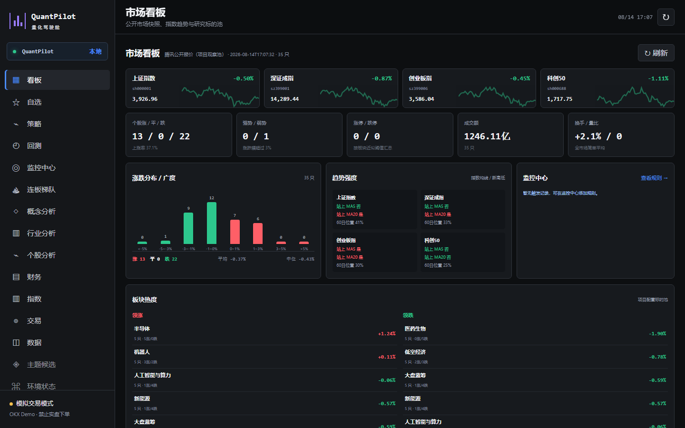
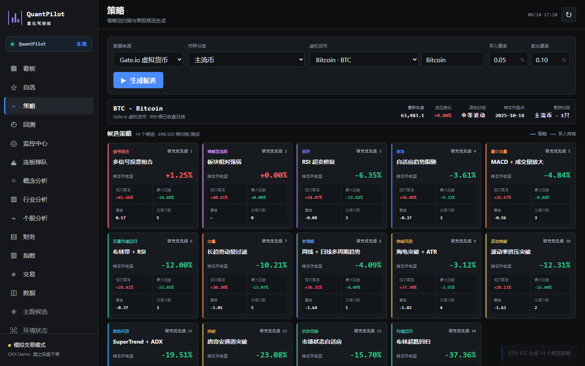

# QuantPilot 量化驾驶舱

**语言 / Language:** 简体中文 · [English](README.en.md)

QuantPilot 是一个本地运行的 A 股与虚拟货币量化驾驶舱，提供行情、自选、策略候选、组合回测、
监控、行业/概念/指数分析、本地模拟交易和 OKX Demo 模拟交易。

> **当前状态：早期实验版本。** 项目整体仍比较粗糙，部分数据源、分析页面、参数说明、
> 高级风控、异常处理和交易适配功能尚不完善，稳定性、准确性与使用体验仍需持续改进。
> 仅用于学习、研究和模拟测试，不应作为实际投资或自动交易依据；项目没有实盘下单入口，
> 也不承诺任何收益。

## 面板预览

### 市场看板

展示主要指数、涨跌分布、市场宽度、趋势强弱、板块热度和监控摘要。



### 策略候选

选择市场、板块与标的后，自动生成并比较多类候选策略。下图为 BTC 日线候选示例，
页面同时展示样本外收益、相对基准、最大回撤、夏普和交易次数。



## 一键启动（Windows）

已经安装依赖时，双击：

```text
一键启动量化面板.cmd
```

启动成功后会自动打开 <http://127.0.0.1:8765>。重复双击不会启动多个服务；
失败原因会直接显示在窗口中。

## 首次安装

需要 Python 3.10 或更高版本：

```powershell
python -m venv .venv
.\.venv\Scripts\python.exe -m pip install -r requirements.txt
```

安装后双击 `一键启动量化面板.cmd`。也可以手动启动：

```powershell
.\.venv\Scripts\python.exe dashboard\server.py
```

如需指定其他 Python，可设置当前终端环境变量：

```powershell
$env:QUANT_DASHBOARD_PYTHON = 'D:\Python\python.exe'
```

## 功能总览

| 模块 | 当前功能 |
| --- | --- |
| 界面语言 | 页面右上角可切换简体中文或 English，选择保存在本机并在下次打开时自动恢复 |
| 市场看板 | 主要指数、涨跌分布、市场宽度、成交概览、趋势强弱和板块热度 |
| 自选与监控 | 本地自选股、价格/涨跌/指标规则、触发记录与监控摘要 |
| 市场分析 | 连板梯队、概念、行业、个股、指数与基础财务覆盖说明 |
| 策略候选 | 为 A 股或虚拟货币自动生成最多 14 个候选策略并进行统一排名 |
| 策略类型 | 趋势、突破、均值回归、SuperTrend + ADX、海龟突破、布林带 + RSI、MACD + 成交量、波动率挤压、多周期、相对强弱、市场状态自适应和多信号组合 |
| 参数实验室 | 按策略显示参数名称与允许范围，修改后重新计算完整样本和样本外结果；支持原始候选与用户版本对比，以及本地保存、命名、加载、复制、删除和 JSON 导入/导出 |
| 研究验证 | 训练/测试隔离、样本外收益、买入持有基准、最大回撤、夏普、胜率、交易次数和费用建模 |
| 组合回测 | 多标的组合、初始资金、最大持仓、总仓位、止盈止损、最长持有期和交易明细 |
| 本地模拟 | 历史留出样本回放、手动买卖、限价待成交与撤单、部分成交/拒单状态；约束 A 股 T+1/整手/余额/涨跌停和虚拟货币小数仓位/最小数量 |
| 交易统计 | 资金曲线、已实现盈亏、浮动盈亏、手续费、持仓市值、信号来源和拒单原因；支持 CSV 导出、清空账户和确认后重新回放 |
| OKX Demo | 加密保存 Demo 凭据、同步资金/持仓/委托/成交、调整策略参数、计算最新信号并二次确认模拟下单；界面明确标记为模拟环境 |
| miniQMT | 填写本机 QMT 目录与账号，只读同步 A 股账户信息，不调用委托接口 |
| 数据与环境 | 统一展示数据模式、覆盖范围、交易日期、更新时间及实时/延迟/缓存状态；可并行检测 A 股、指数、涨停池、虚拟货币和本地文件数据源 |

## 典型使用流程

1. 在“看板”了解指数、涨跌分布与板块状态，或将标的加入自选。
2. 进入“策略”，选择腾讯 A 股、Gate.io 虚拟货币或本地 CSV，再选择板块与标的。
3. 生成候选策略，对比样本外收益、相对基准、回撤、夏普和交易次数。
4. 选择候选后查看信号规则、参数、净值曲线和最近交易；可修改参数并重新计算，也可把方案保存为本地版本。
5. 在“数据”页检查各数据源的模式、交易日期、更新时间和可用状态。
6. 将策略部署到本地模拟账户进行历史回放；虚拟货币策略也可带到 OKX Demo。
7. 在 OKX Demo 中修改参数、计算最后一根已完成日线信号，并在人工检查后确认模拟订单。

QuantPilot 当前不会在后台无人值守地自动运行策略，也不会自动提交订单。

## 数据来源

- 腾讯公开 A 股行情。
- Gate.io 公开虚拟货币 K 线。
- 东方财富全市场涨停池，以及部分市场快照的备用来源。
- `data/raw/` 中的本地 CSV 快照。

网络行情不可用时，市场页会保留上次本地快照。运行时缓存和账户配置都位于
`data/processed/` 或 `.market-cache/`，默认不会提交到 Git。

## 模拟交易安全

- OKX 适配器固定发送 `x-simulated-trading: 1`。
- 只允许 `*-USDT` 现货市价模拟单。
- 每笔模拟订单都要经过浏览器二次确认和服务端确认标记校验。
- API 凭据使用 Windows DPAPI 加密保存在当前用户本机，不写入前端或 Git。
- miniQMT 当前只读，不调用委托接口。

详细配置见 [docs/BROKER_ADAPTERS.md](docs/BROKER_ADAPTERS.md)。

## 项目结构

```text
dashboard/                 面板后端、前端、策略工厂和交易适配器
src/quant_trading/         公共行情客户端
scripts/check_environment.py  面板环境自检
tests/                     面板确定性测试
docs/                      模拟交易配置说明
data/                      本地行情与运行时状态（默认不提交）
requirements.txt           Python 依赖
一键启动量化面板.cmd        Windows 启动入口
```

## 测试

```powershell
$env:PYTHONPATH = "$PWD\src"
python -m unittest discover -s tests
```
